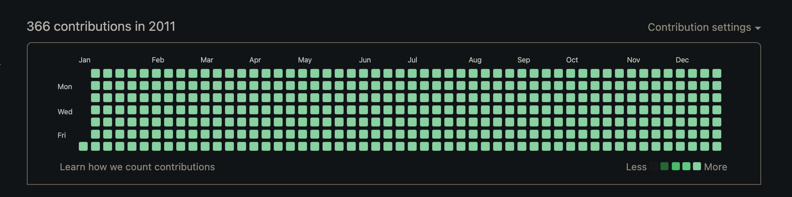

# Github

## Descripion
This script allows you to push commits in the past. 
You can use it to impress HR specialists with your green GitHub account.

## Usage
1. fork and clone this repo
2. `npm i`
3. add years to commit.js file
4. `chmaod +x ./commit.sh`
5. `npm run start`